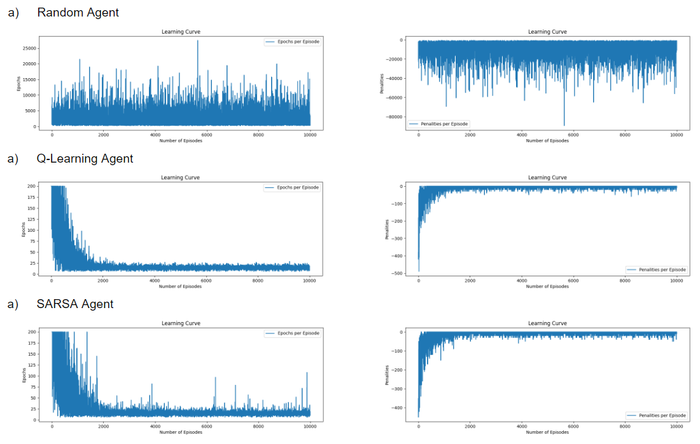

# <h1 align="center">Taxi V3 Environment Solution using Reinforcement Learning</h1>

This repository contains the code developed for the coding interview task for a Research Engineering role. We experimented multiple reinforcement learning algorithms and summarised our findings in the figures below, with a detailed description of how to run our solution.

Table of Contents
=================

<!--ts-->
   * [Project Setup](#project-setup)
   * [Experimental Notebooks](#experimental-notebooks)
   * [Solution](#solution)
   * [Results](#results)
<!--te-->


Project Setup
============
To run the project, it is recommended to setup a vitual environment and install all the packages inside the `requirements.txt` file.

Experimental Notebooks
============
To understand the step by step of each approach implementation, or to see intermediate results, several notebooks can be found inside the `notebooks` folder.

Solution
============
As we used a reinforcement learning approach to solve the problem, we experimented different approaches to find which one can converge to the optimal result. Our implementation can be run using the command-line file `solution.py` to train and test each experiment approach individually. To see which of the arguments to pass to the file, you can run `python solution.py --help`

```
usage: solution.py [-h] [--algorithm ALGORITHM] [--n_episodes N_EPISODES] [--force_visualize FORCE_VISUALIZE] [--export_results] [--output_dir OUTPUT_DIR]

options:
  -h, --help            show this help message and exit
  --algorithm ALGORITHM
                        Algorithm to solve the task. Has to be one of ["qlearning", "random", "sarsa"].
  --n_episodes N_EPISODES
                        Number of episodes to use for training. Default value is `10000`.
  --force_visualize FORCE_VISUALIZE
                        visualizing is disabled for random agent solution, as it will fill the command line. To visualze the test simulation of the random
                        agent, set this flag to `True`.
  --export_results      Set this flag to `True` when it is necessary to export performance metrics, such as `penality per episode` or `epochs per
                        episode`. This automatically creates an outputs folder, and saves the filename based on the timestamp.
  --output_dir OUTPUT_DIR
                        Output directory to export the figures. Default is `.\outputs`.
```

An explanation for the values to pass to each argument is summarized in the following table.

| Argument    | Required | Required    |
| -------- | ------- | ------- |
| --algorithm | Optional | An argument to define which model type to use for training and evaluation. There are three options ["random", "qlearning", "sarsa"]. Option "random" trains a random agent based on random sampling, "qlearning  obtion trains a q-learning agent based on q-learning algorithm, and "sarsa" agent trains a SARSA algorithm. The default value is "qlearning" |
| --n_episodes | Optional | Number of episodes to run. The default is 10000 |
| --force_visualize | Optional | This flag is only important if you need to visualize the "random" agent test result. As the random agent never convirges to a solution due to it's random selection, it goes through the full number of epochs (default is 200); thus we set it to never visualize unless this flag is passed. To visualize, just use the flag `--force_visualize` and it will set to True automatically. |
| --export_results    | Optional | Exports the learning curves for the agents. By default, this export doesn't occur. To export, just use `--export_results` and it will set it to True automatically |
| --output_dir | Optional | Output directory to for the export. The default is `.\outputs` and the folder will be created automatically.  |


And thus, an example of running a "qlearning" agent training experiment and exporting its results is shown in the command line below.

```python
python solution.py --algorithm "qlearning" --export_results
```

Results
============

After each training session, we tested all of the experiments and recorded the penality per episode and number of epochs per episode. The ideal situation should be less training epochs and less penalities for the trainable epochs. We demonestrate below some of the results below.


We can see that the random agent doesn't learn of improve with more episodes, and results in total random and large penality values for all episodes. The Q-learning agent has a slightly smoother curves and converges faster than the SARSA agent, and requires less trainable epochs.

We also validated those results by comparing both the Q-learning agent and SARSA agent in a separate file on 100 samples, where we train each of the agents, and obtain a q-table for each of them. We then use the obtained q-table to solve 100 sample test cases and averaged the results. To run the evaluation, please run `python evaluate.py` command. We obtained the following output of the performance evaluation.

```python
             training_time  average training epochs (n=100)  average total rewards
ql_agent          6.629119                            12.94                   8.06
sarsa_agent       4.922590                            24.25                  -4.51
```
The results also emphasizes that the Q-learning approach performes better when we take into account the average trainable epochs for all episodes, and average total rewards. The rewards can be in negative taking into account the penality obtained, thus the Q-learning agent seems to be a better approach to solve the problem.
